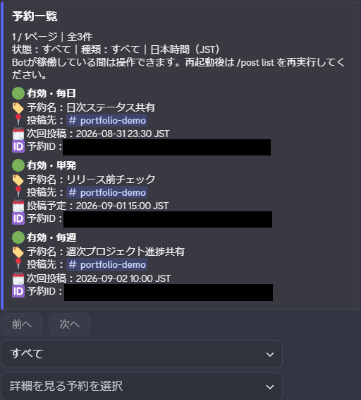
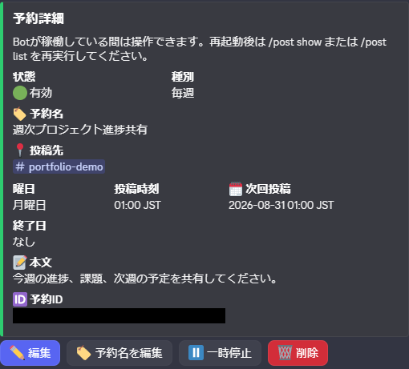
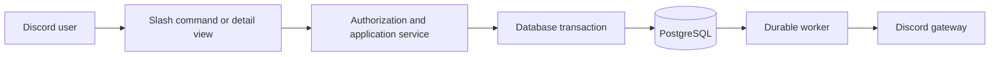

# Discord AI Reminder Bot

[](https://github.com/otolude/discord-ai-reminder-bot/actions/workflows/ci.yml?query=branch%3Adevelop)

PythonとPostgreSQLで、単発・毎日・毎週の予約投稿に加え、競合制御・障害復旧・誤操作防止まで実装した、安全な運用を重視するDiscord Botです。

> Discord AI Reminder Bot is a Python and PostgreSQL-based bot for scheduling one-time, daily, and weekly Discord posts. It uses PostgreSQL-backed durable workers and startup recovery, with explicit boundaries for interactions, authorization, concurrency control, and database migrations. It also includes a provider-isolated foundation for AI-assisted schedule naming, which is disabled by default. The project is currently in local development and portfolio preparation; it is not publicly deployed, and live AI provider validation remains pending.

## 概要

Discordで後から投稿したい内容を予約し、一覧、詳細、編集、一時停止、再開、削除まで管理する個人開発プロジェクトです。要件定義、技術設計、実装、自動テスト、実Discord受入、運用RunbookをPhaseごとに整備しています。

操作画面だけでなく、PostgreSQL上の競合制御、Bot再起動時のRecovery、保持期限cleanup、Migrationの接続先誤り防止、AI Provider障害時の非AI継続までを開発範囲に含めました。現在はローカル開発・GitHubポートフォリオ整備段階で、一般公開や常時稼働はしていません。

## 解決する課題

- Discord内で予約投稿を作成・確認・変更し、別の管理画面を往復せずに済むようにする
- 再起動、二重操作、権限変化、外部処理の結果不明があっても、投稿や予約状態を安全側に保つ
- 開発DBとtest DB、通常Botと任意のAI Provider受入を分離し、誤操作を早期に拒否する
- 実装済み、隔離テスト済み、実Discord確認済み、未実装を区別して説明する

## 主要機能

- `/post create`、`create-daily`、`create-weekly`による単発・毎日・毎週の予約
- `/post list`、`show`、Autocompleteによる一覧・詳細・候補表示
- 詳細Viewまたはコマンドからの編集、一時停止、再開、論理削除
- owner／administrator／guild／DM境界と、操作時点の再認可
- 最大32文字の手動予約名と、本文を使わないJSTフォールバック名
- PostgreSQLに永続化した投稿・通知・予約名生成Worker、Recovery、cleanup
- 本文や予約名全文を含めないOperationLog
- fail-closedなMigration安全ラッパー
- Provider非依存の予約名生成Job／Budget／CASと、隔離されたOpenAI Adapter

## 現在の開発状態

| 対象 | 状態 | 補足 |
| --- | --- | --- |
| 基本予約と詳細操作 | 実装済み・実Discord確認済み | 単一設定guildを対象としたローカル開発 |
| 長寿命View／Modal | 実装済み・自動隔離テスト済み・実Discord確認済み | nonce、競合、timeout、Bot close回収を確認 |
| 手動予約名とJSTフォールバック | 実装済み・実Discord確認済み | 一覧や候補へ本文previewを表示しない |
| AI Job／Budget／Worker | 基盤のみ実装済み・自動隔離テスト済み | ProviderとAIは初期無効 |
| OpenAI Adapterと受入CLI | 基盤のみ実装済み・無通信テスト済み | 実API品質、保持、請求は未確認 |
| ARM64 Linux | 未確認 | 公開前の配置環境で確認予定 |
| 常時稼働・一般公開 | 未実装 | 現在はローカル開発・ポートフォリオ段階 |
| subscription・payment | 将来計画 | Plan、Quota、契約、決済は未実装 |

詳細な状態と根拠は[検証スナップショット](docs/portfolio/verification.md)を参照してください。

## 代表画面

専用開発guildの合成データだけで撮影し、完全な予約UUIDを不透明に焼き込み匿名化した画面です。一覧は撮影用予約全5件のうち、代表3件が見える範囲を掲載しています。





編集Modalと予約投稿結果を含む4枚の説明は[機能フロー](docs/portfolio/feature-flows.md)、匿名化・metadata監査は[asset manifest](docs/portfolio/assets/manifest.md)を参照してください。

## 技術スタック

| 分類 | 技術 | 採用理由・役割 |
| --- | --- | --- |
| Runtime | Python `>=3.14,<3.15`、asyncio | Discord Interactionと複数Workerの非同期処理 |
| Discord | discord.py `>=2.6,<3` | Slash command、View、Modal、Gateway連携 |
| Database | PostgreSQL、SQLAlchemy `>=2.0,<2.1` | transaction、row lock、永続Worker状態 |
| Migration | Alembic `>=1.18,<2` | Schema履歴とsingle head検証 |
| Test | pytest `>=9,<10`、pytest-asyncio `>=1,<2` | Domain、Fake Interaction、実ViewStore、PostgreSQL統合の分離 |
| Quality | Ruff `>=0.12` | lintとformatの同一ツール化 |
| AI境界 | OpenAI Python SDK `>=2.54,<2.55`、httpx `>=0.28,<0.29` | Provider Adapterと無通信contract test |
| Local environment | Docker Compose、WSL2／Linux | 開発DBと専用test DBの分離 |
| Documentation | Markdown、Mermaid | 差分レビュー可能な構成図と機能フロー |

依存versionの正本は[pyproject.toml](pyproject.toml)です。WSL2 x86_64での記録はありますが、ARM64実機は未確認です。

## 代表的な利用フロー



予約作成、投稿、編集競合、Recovery、AI名生成、Migrationの詳しい流れは[機能フロー](docs/portfolio/feature-flows.md)に分離しています。

## 設計上の工夫

| 課題 | 判断 | 実装 |
| --- | --- | --- |
| 同種Modalを複数開くと古いModalがdispatchされない | 外側Modalだけに非識別nonceを付け、instance単位で管理する | registry、有限timeout、二重submit防止、Bot close時回収、実ViewStoreテスト |
| 古い詳細からの更新が最新状態を上書きし得る | 表示時versionを期待値とし、transaction内で再認可・再検証する | row lock、optimistic concurrency／CAS、固定競合案内、安全な最新詳細更新 |
| test用Migrationが開発DBへ向く誤操作が起き得る | 操作前と接続後の二層で対象DBを完全一致確認する | Pythonラッパー、操作束縛confirmation、`current_database()`照合、fail-closed |
| AI失敗で基本予約まで失敗させたくない | AIなしの名前基盤を先に完成させ、ProviderをPortの外へ隔離する | JSTフォールバック、永続Job／Budget、DB外生成、CAS保存、初期disabled、再試行なし |

不具合を隠すのではなく、再現、直接原因の特定、境界の修正、回帰テスト、運用文書化までを一つの作業単位として扱っています。

## アーキテクチャとディレクトリ責務

| パス | 責務 |
| --- | --- |
| `src/discord_ai_reminder_bot/domain` | 状態遷移、値検証、Policy、時刻計算 |
| `src/discord_ai_reminder_bot/application` | Use case、transaction境界、Worker、Recovery、cleanup |
| `src/discord_ai_reminder_bot/bot` | Discord command、Presenter、View／Modal、Interaction応答 |
| `src/discord_ai_reminder_bot/infrastructure` | PostgreSQL Repository、Discord Gateway、AI Adapter、Migration安全処理 |
| `alembic` | Schema Revisionとupgrade／downgrade guard |
| `tests` | unit、Fake Interaction、実ViewStore、PostgreSQL integration |
| `docs` | 要件、設計、運用、受入、ポートフォリオ資料 |

依存方向とWorker構成は[アーキテクチャ](docs/portfolio/architecture.md)で説明しています。

## 安全性・プライバシー

- 最新Interactionでguild、owner、administrator、許可ロールを再検証
- expected version、transaction、row lock、CASによる競合境界
- `AllowedMentions.none()`、ephemeral応答、識別情報を含めないcustom ID
- Migrationラッパーと`alembic/env.py`による接続先の二層確認
- AIは初期disabled、Provider retry 0、呼出前の悲観Budget予約
- 本文、生成名、Discord ID、契約情報をAI Job／Budgetへ保存しない
- APIキー、Provider例外全文、予約本文を通常ログへ出さない

絶対的な安全性を主張するものではありません。実装した境界、未確認事項、将来方針は[安全性とプライバシー](docs/portfolio/security-and-privacy.md)に記録しています。

## テスト・受入状況

2026-08-30時点の記録です。件数は対象commitのスナップショットであり、品質、可用性、セキュリティを恒久保証する値ではありません。

- 通常pytest: 1,019 passed／349 skipped
- 専用PostgreSQL込みpytest: 1,368 passed
- Phase 1: 63／63
- Phase 2: 47／47
- Phase 3: 6C-1ローカル隔離受入後120／126。最新集計は[Phase 3受入表](docs/manual-acceptance-phase3.md)を正本とする
- 実OpenAI Provider受入とARM64 Linux実機確認は未確認

環境、対象commit、Ruff、Migration、証跡区分、更新方法は[検証スナップショット](docs/portfolio/verification.md)を参照してください。

## 最短セットアップ入口

前提はWSL2またはLinux、CPython 3.14、Docker Engine／Compose、Discord Applicationです。値を表示せず、`.env.example`からローカルの`.env`を作成します。

```bash
python3.14 -m venv .venv
source .venv/bin/activate
python -m pip install -e '.[dev]'
cp .env.example .env
git check-ignore .env
docker compose up -d postgres
python -m discord_ai_reminder_bot.infrastructure.database.health
python -m discord_ai_reminder_bot.infrastructure.database.migrate --target development --expected-database discord_bot_dev --confirm development:discord_bot_dev:upgrade upgrade head
python -m pytest
python -m ruff check .
python -m ruff format --check .
python -m discord_ai_reminder_bot
```

実tokenや接続URLを例示せず、`.env`をcommitしないでください。Alembic CLIを直接使わず、開発DBと専用test DBを混同しないでください。Discord設定、test DB、停止、障害対応の詳細は[運用Runbook](docs/operations.md)を参照してください。OpenAIは初期disabledです。通常READMEには実Providerのlive実行・課金手順を掲載しません。

## 開発プロセス

`要件定義 → 技術設計 → 実装 → unit test → PostgreSQL integration test → manual acceptance → operations更新 → commit／push → 次段階`を基本単位にしています。GitHub ActionsのCI構成、Issue Form、`develop`上の初回CI成功を確認済みです。外部Pull Requestは積極募集していません。

## ロードマップ

- 完了: Phase 1、Phase 2、Phase 3の予約名2A、永続基盤2B、OpenAI隔離基盤2C、ポートフォリオ6A
- 完了: Phase 3第6項6B。本文・図の6B-1と画像の6B-2を分離して受入済み
- 完了: Phase 3第6項6C-1の運営ファイル・CI構成、ローカル隔離受入、GitHub Actions初回成功確認
- 延期中: 実OpenAI Provider受入、ARM64 Linux実機確認
- 今後: 6C公開前監査、公開前限定テスト、常時稼働環境、subscription商品仕様と決済、正式リリース

詳細は[開発・公開ロードマップ](docs/development-roadmap.md)を参照してください。

## 詳細文書

- [ポートフォリオ掲載計画](docs/portfolio-plan.md)
- [アーキテクチャ](docs/portfolio/architecture.md)
- [機能フロー](docs/portfolio/feature-flows.md)
- [安全性とプライバシー](docs/portfolio/security-and-privacy.md)
- [検証スナップショット](docs/portfolio/verification.md)
- [スクリーンショット方針](docs/portfolio/screenshot-policy.md)
- [画像asset manifest](docs/portfolio/assets/manifest.md)
- [要件](docs/requirements-beta.md)
- [技術設計](docs/technical-design-beta.md)
- [運用Runbook](docs/operations.md)
- [Phase 1受入](docs/manual-acceptance-phase1.md)／[Phase 2受入](docs/manual-acceptance-phase2.md)／[Phase 3受入](docs/manual-acceptance-phase3.md)

## ライセンス・公開状態

本リポジトリにはオープンソースライセンスを付与していません。独自のソースコードと文書は`Copyright (c) 2026 Oto. All rights reserved.`として扱い、明示的な書面許可がない複製、改変、再配布、転載、二次利用、商用利用を許可しません。GitHub利用規約上の閲覧・fork、第三者コンポーネントと商標、無保証等の詳細は[Copyright Notice](COPYRIGHT.md)を参照してください。

GitHubで公開し、就職活動での企業提示とクラウドワークス等の案件応募に使用する予定ですが、現在は公開前準備中です。実際のrepository visibilityは6Cで確認し、public化は6C監査合格と利用者の最終承認後に手動で行います。バグ報告・改善提案は[Contributing](CONTRIBUTING.md)、脆弱性報告は[Security Policy](SECURITY.md)を参照してください。Private vulnerability reportingはpublic化直前に有効化予定です。CI badgeは2026-08-31に対象commitで成功を確認したworkflowを参照します。Code of Conduct、PR template、個人連絡先は追加していません。
