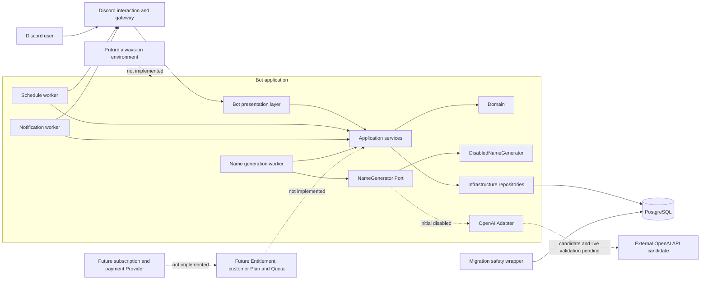

# アーキテクチャ

## 1. この文書の範囲

本書は、現在のローカル開発構成を第三者向けに要約する。実host、port、DB名、Discord ID、Project ID、資格情報、内部Worker IDは掲載しない。要件の正本は[要件](../requirements-beta.md)、詳細設計の正本は[技術設計](../technical-design-beta.md)である。

## 2. 現在の論理構成

実線は現在のApplication内で接続されている経路である。OpenAI Adapterはコードと無通信contract testが存在するが、初期設定はAI無効かつProvider disabledで、実API受入は未実施である。破線のEntitlement、顧客Plan／Quota、subscription／payment、常時稼働環境は未実装の将来境界であり、現在接続済みではない。

## 3. レイヤーと依存方向

| レイヤー | 主な責務 | 依存上の境界 |
| --- | --- | --- |
| Domain | Schedule状態、値検証、時刻・retry・Budget Policy | Discord、SQLAlchemy、OpenAI SDKを参照しない |
| Application | Use case、transaction境界、DTO、Worker、Recovery、cleanup | BotへORMを返さず、ProviderはPort越しに扱う |
| Bot | command、Autocomplete、Presenter、View／Modal | Interactionを検証し、Applicationへ現在の権限を渡す |
| Infrastructure | Repository、DB model、Discord Gateway、AI Adapter、Migration安全処理 | 外部技術固有の例外や型を内側へ漏らさない |

この分離により、Domainの状態遷移をDiscordやDBなしで検証し、Applicationの境界をFake／Mockで検証し、Repositoryのtransaction・lock・制約を専用PostgreSQLで検証できる。

## 4. 永続化と並行制御

PostgreSQLにはSchedule、ScheduleRun、DeliveryAttempt、OperationLog、NotificationLog、予約名生成Job、運営Budget bucketを保持する。Schedule操作は短いtransaction内で対象行をlockし、詳細表示時のexpected versionを再検証する。AI生成はclaimと悲観Budget予約をcommitしてSessionを閉じた後に実行し、別の短いtransactionでCAS finalizeする。

Worker状態をDBへ永続化した理由は、Bot processの再起動をまたいで未処理・処理中・結果不明を分類し、二重投稿や無制限なProvider再呼出しを避けるためである。投稿、通知、AI生成は同じretry方針ではなく、それぞれの結果不明境界に合わせる。

## 5. Workerとlifecycle

| Component | 役割 | Recovery／shutdown |
| --- | --- | --- |
| Schedule worker | due runのclaimとDiscord投稿 | 起動時に処理中runを分類し、結果不明では二重投稿を避ける |
| Notification worker | creator／operator通知のoutbox処理 | 通知専用のattemptとfallbackを管理する |
| Name generation worker | Job claim、Budget予約、DB外Generator、CAS finalize | lease切れを再呼出しせずabandoned化し、shutdown taskをcancel・awaitする |
| cleanup | 終端Scheduleと関連履歴、AI Job、Budget bucketの保持期限処理 | 対象別rollbackとFK保持境界を維持する |

Bot終了時は新しいpollを止め、実行中task、View／Modal、Discord client、DB engineを既定順で回収する。二重closeと未回収taskを自動テストで扱うが、24時間の本番運用実績を意味しない。

## 6. 技術選定の要点

- PostgreSQL: row lock、一意制約、部分index、transactionによるprocess間の競合制御に使用する。
- SQLAlchemy: ORM modelと非同期SessionをInfrastructureへ隔離し、ApplicationへORMを露出しない。
- Alembic: Schema履歴を1本のheadで管理し、Revision固有guardと接続先二層確認を組み合わせる。
- NameGenerator Port: AI Provider、顧客Plan、決済を予約DomainやWorkerへ直接依存させない。
- Markdown／Mermaid: 実環境情報を載せず、コードと同様に差分レビューできる図を維持する。

## 7. 未実装・未確認

- OpenAI実APIでの日本語品質、時間、token、費用、保持、請求、dashboard条件
- ARM64 Linux実機での依存解決と無通信contract
- Plan、Entitlement、顧客Quota、契約、決済Webhook
- 常時稼働、本番監視、一般公開、正式リリース

これらは現在の構成図で破線または文章上の未実装・未確認として扱い、実績に含めない。
