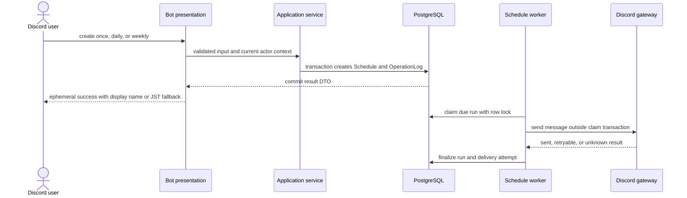
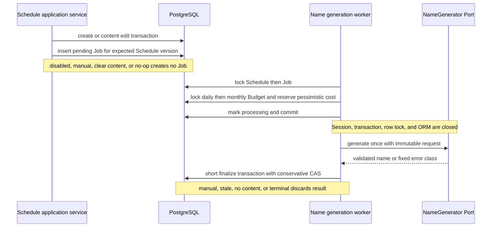
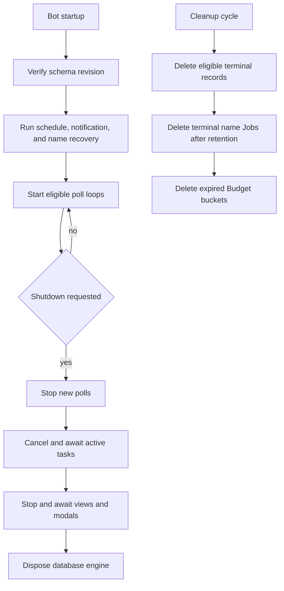
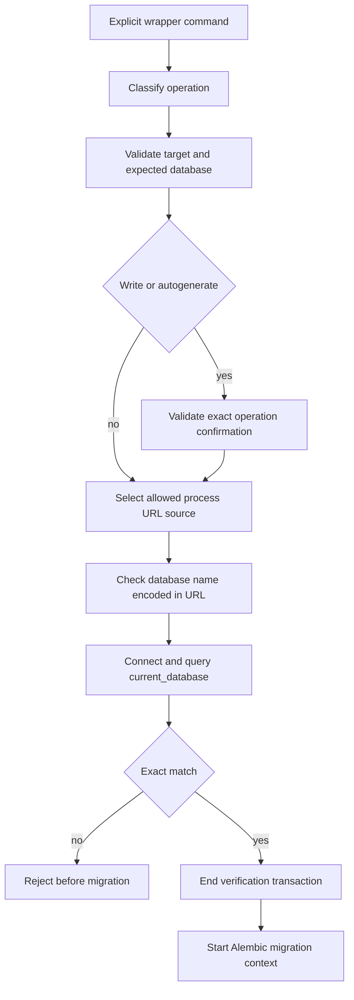

# 機能フロー

## 1. 予約の作成と通常投稿

JSTフォールバック名は表示時の純粋関数で、DBへ保存せず本文を一覧・Select・Autocompleteへ出さない。投稿の一時エラーには上限付きretryがある一方、結果不明では二重投稿防止を優先する。

## 2. 詳細操作、競合、削除

| 操作 | transaction前 | transaction内 | 結果 |
| --- | --- | --- | --- |
| 一時停止・再開 | guild、owner／administrator、状態を確認 | Scheduleをlockし、expected versionと現在状態を再検証 | 実変更だけversionとOperationLogを更新 |
| 本文・日時編集 | Modalまたはcommand入力を検証 | 同じSchedule行で再認可、再検証、原子的更新 | staleなら固定競合案内と安全に取得できる最新詳細 |
| 手動予約名 | 現在名をModal初期値に使用 | source、状態、expected versionを再検証 | 設定・変更はmanual、空欄はunset、同値はno-op |
| 論理削除 | 対象と操作権限を確認 | lock後にversion・状態・管理者理由を再検証 | deletedとして保持し、30日cleanup対象へ移す |

詳細Viewを開いた後に権限を失った場合は古いEmbedとViewを解除し、他人の本文、予約名、投稿先、UUIDを再表示せず固定案内だけを返す。外側Modalのcustom IDには非識別nonceを付け、同種Modalを複数保持しても別instanceを停止しない。

## 3. AI予約名のJob登録とCAS保存

成功時だけ`display_name`と`source=ai`を保存し、利用者操作用Schedule versionと`updated_at`は増やさない。system OperationLogへ生成名全文を保存しない。Provider timeout、cancel、usage不明でも予約済みBudgetを返却せず、自動retry、model fallback、基本予約の失敗を行わない。OpenAI Adapterは初期disabledで、実Provider受入は未確認である。

## 4. startup recovery、poll、shutdown、cleanup

起動時Recoveryはpoll開始前に行う。予約名生成のlease切れ`processing`はProviderを再呼出しせず`startup_abandoned`へ移し、`pending`は維持する。cleanupはpending／processing Jobを削除せず、ScheduleのFK blockerと保持順序を尊重する。

## 5. Migration安全ラッパー

正式経路はPythonラッパーだけで、Alembic CLI直接実行、offline mode、未知commandを`alembic/env.py`の最終ガードでも拒否する。test、development、productionでURL選択を分離し、URLや資格情報をログへ出さない。

## 6. 情報境界

Interaction応答はephemeralと`AllowedMentions.none()`を必要箇所で使用し、拒否時に内部例外や他人予約を露出しない。AI Job／Budgetには本文、prompt、応答、生成名、Discord ID、UUID、契約情報を保存しない。詳細な境界は[安全性とプライバシー](security-and-privacy.md)を参照する。
